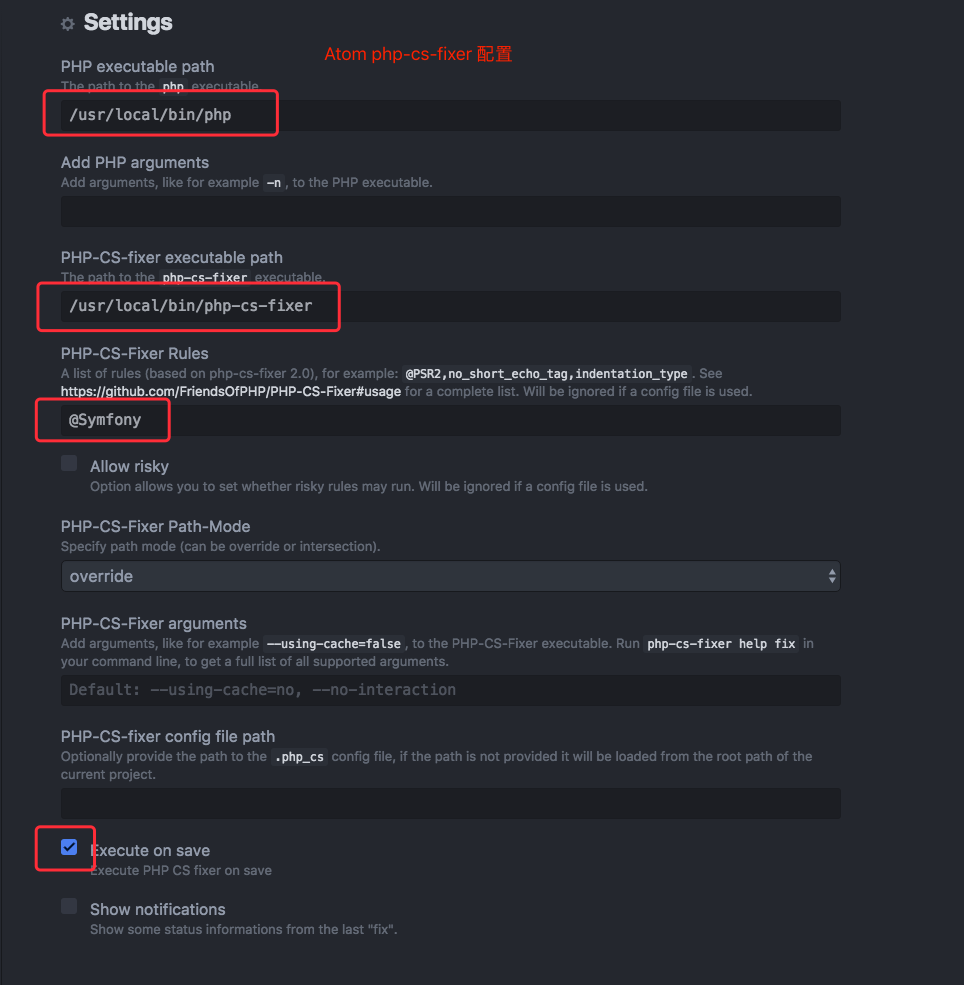

Atom IDE配置
============

## 下载

https://atom.io/

## 安装插件

### 推荐安装的插件列表

* atom-autocomplete-php （PHP自动提示插件）
* php-cs-fixer （PHP代码格式化插件）
* atom-beautify（格式化html,twig,css,js等语法）
* docblockr（支持块注释语法）
* linter-php（实时检查php语法，会自动安装以下依赖）
  * linter
  * intentions
  * linter-ui-default
  * busy-signal
* php-twig （支持twig语法和提示）
* SFTP-deployment （通过SFTP远程部署调试）
* editorconfig （支持不同IDE统一语法规范配置）
* minimap （右侧代码缩略图，快速拖动和定位代码）
* platformio-ide-terminal （集成终端）
* git-blame （Atom中直接查看git blame）

### 插件配置

只列举需要配置的插件，其他插件默认配置即可

#### php-cs-fixer



## 代码规范配置

### 安装规范工具

编码规范采用Symfony规范，详见
http://symfony.com/doc/current/contributing/code/standards.html

首先需要安装以下软件到本机
* PHP（推荐5.6.x或7.1.x）
* PHP CodeSniffer
* php-cs-fixer

### 配置代码规范

把Atom插件php-cs-fixer设置项中的PHP-CS-Fixer Rules一栏，填入@Symfony，参见前面的插件配置的截图

## (针对Windows用户)设置sftp同步代码

如果是Windows下的开发者，用ubuntu虚拟机做开发，则需要在配置代码同步。

（虚拟机共享目录的方式，由于不支持linux软链接，npm安装可能会遇到问题。）

### 先配置好虚拟机

参考[利用VirtualBox快速搭建开发环境](virtual-box-setup.md)

获取到虚拟机固定IP和root密码，默认预设IP是192.168.56.10，密码为root

### 准备好代码目录

需要准备两份代码，一份跑在ubuntu运行，一份在本地用来写代码

* git clone一份到ubuntu虚拟机的/var/www目录下
* git clone或者复制一份到Windows的任意目录，方便用PHP Storm打开即可

### 配置Atom代码同步

Windows下用ctrl+shift+p呼唤出命令面板，输入mapToRemote，会自动在项目根目录创建一个deployment-config.json文件，编辑信息：

```json
{
    "type": "sftp",
    "host": "192.168.56.10",
    "username": "root",
    "password": "root",
    "port": 22,
    "remotePath": "/var/www/project-name",
    "uploadOnSave": true
}
```

配置完成最后一步代码同步后，可以在Windows的Atom中编写代码，保存会自动同步到ubuntu虚拟机的代码目录，最后用ubuntu上的git提交代码。推荐做法是Windows上只编写代码，其他都在ubuntu里去做。

