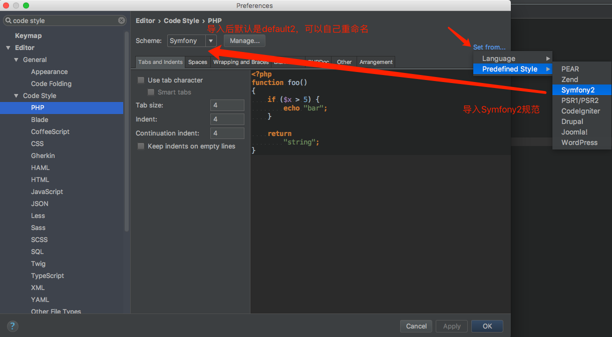
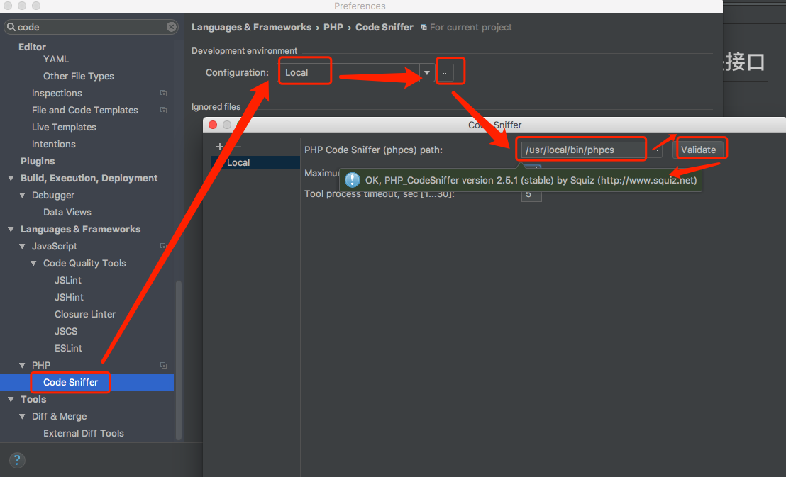
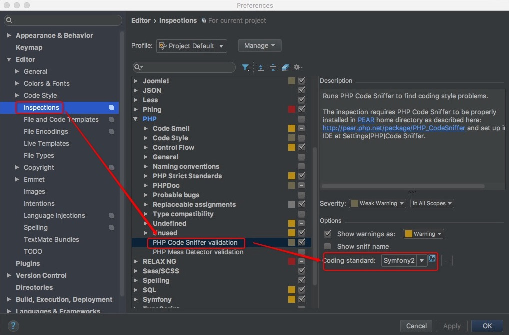
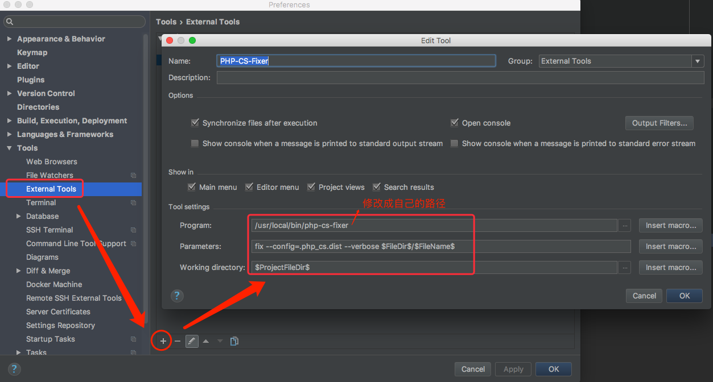
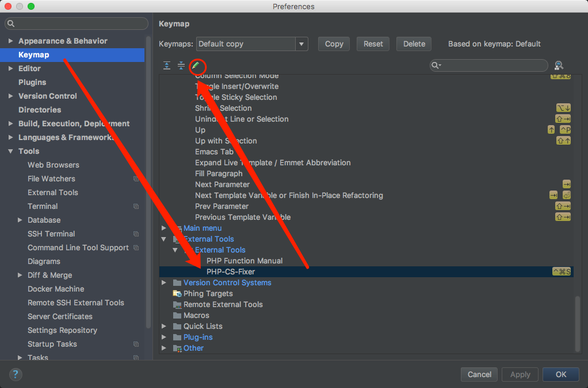
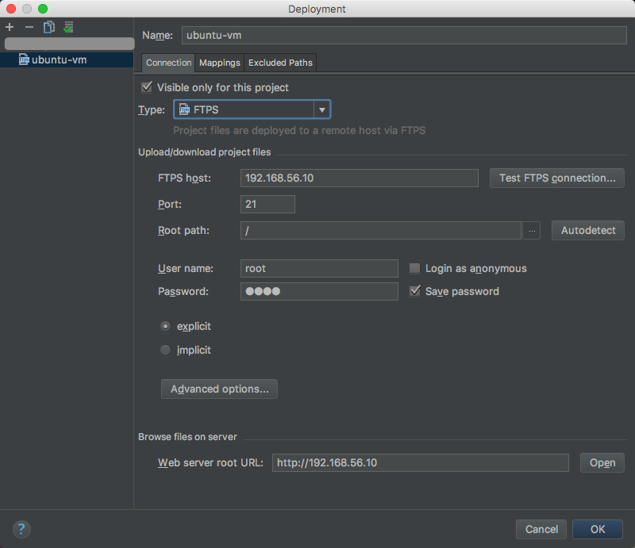
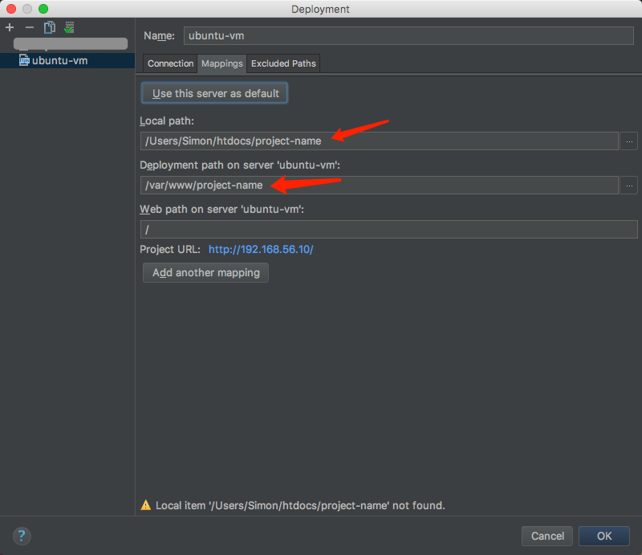
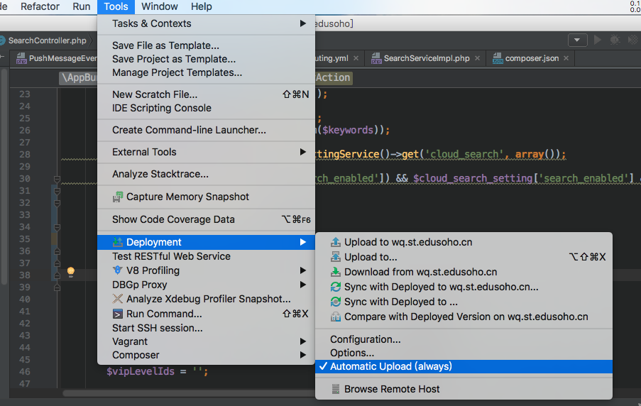

PHPStorm IDE配置
===============

## 安装插件

* symfony plugin
* Php Inspections (EA Extended)

## 代码规范配置

### 安装规范工具

编码规范采用Symfony规范，详见
http://symfony.com/doc/current/contributing/code/standards.html

首先需要安装以下软件到本机
* PHP CodeSniffer
* php-cs-fixer

    装好php code sniffer之后，安装symfony规范，参考https://github.com/djoos/Symfony2-coding-standard

### 配置代码规范

#### 配置CodeSniffer

指定php code style为symfony

配置code sniffer的路径

配置code sniffer校验

#### 配置php-cs-fixer

添加一个外部工具

设置好快捷键

PS：PHPStorm没有找到保存自动格式化的方式，所以需要手动格式化。

## (针对Windows用户)设置sftp同步代码

如果是Windows下的开发者，用ubuntu虚拟机做开发，则需要在配置代码同步。

（虚拟机共享目录的方式，由于不支持linux软链接，npm安装可能会遇到问题。）

### 先配置好虚拟机

参考[利用VirtualBox快速搭建开发环境](virtual-box-setup.md)

获取到虚拟机固定IP和root密码，默认预设IP是192.168.56.10，密码为root

### 准备好代码目录

需要准备两份代码，一份跑在ubuntu运行，一份在本地用来写代码

* git clone一份到ubuntu虚拟机的/var/www目录下
* git clone或者复制一份到Windows的任意目录，方便用PHP Storm打开即可

### 配置PHP Storm代码同步

配置完成最后一步代码同步后，可以在Windows的PHP Storm中编写代码，保存会自动同步到ubuntu虚拟机的代码目录，最后用ubuntu上的git提交代码。推荐做法是Windows上只编写代码，其他都在ubuntu里去做。

