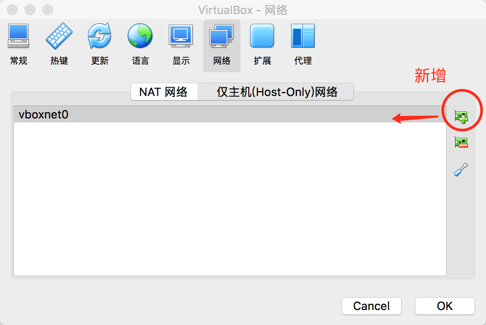
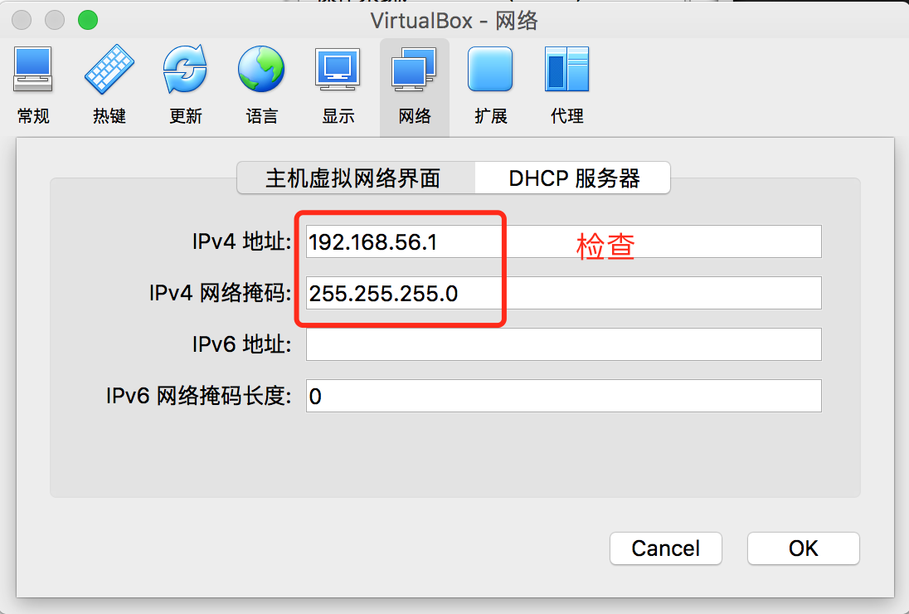
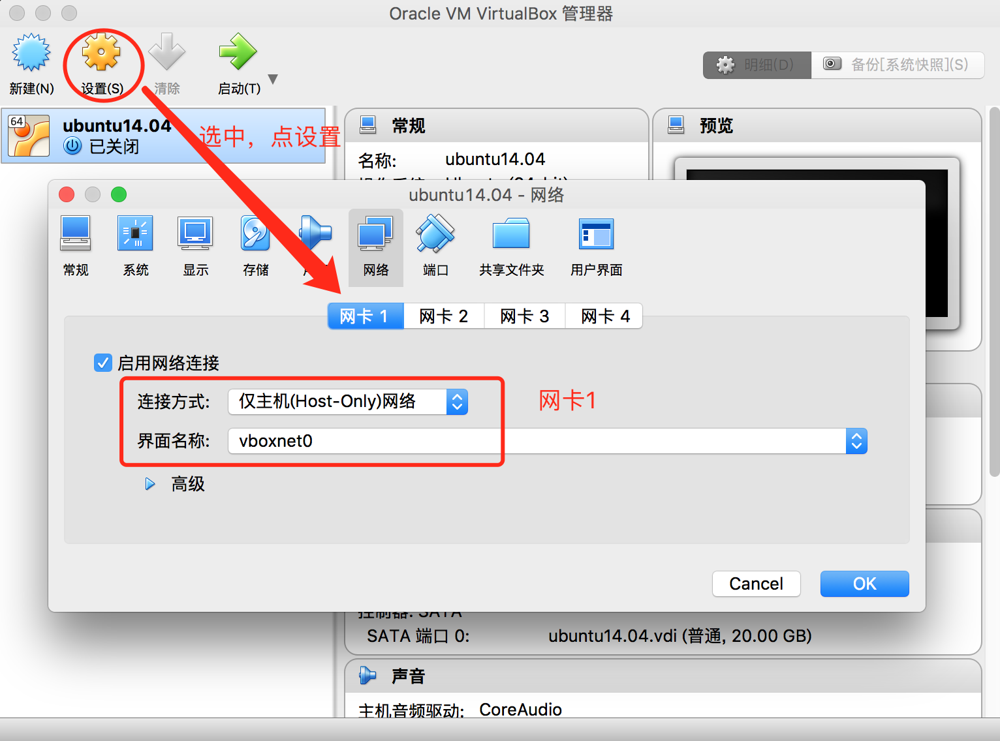
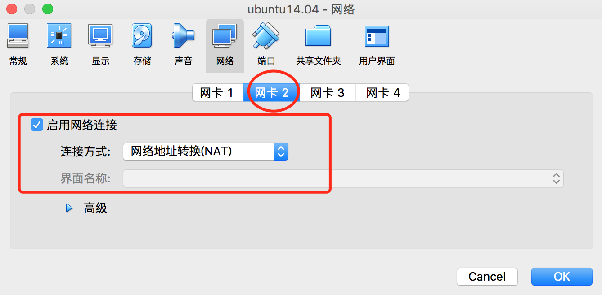

利用VirtualBox快速搭建开发环境
==========================

## 下载安装

VirtualBox下载 https://www.virtualbox.org/wiki/Downloads

预装php开发环境的ubuntu虚拟机下载
* 百度盘 https://pan.baidu.com/s/1c1NUtYK
* 找组长或同事复制一个
    
下文中ubuntu都表示该ubuntu虚拟机
    
## 配置网络

需要给ubuntu配置固定IP，以便我们ssh登录

1. 新增一个Host-Only网络

    VirtualBox配置->网络->切换到"Host-Only"选项卡->新增一个网络，双击该网络检查一下IP是否为192.168.56.1
    
    
    
    

2. 给ubuntu配置两个网卡：

    
    
    
    
## 启动ubuntu检查网络连接

ubuntu预装的网络信息

```
IP: 192.168.56.10
```

检查连接

```
ssh root@192.168.56.10
#root密码：root
```

推荐ssh远程工具xshell

